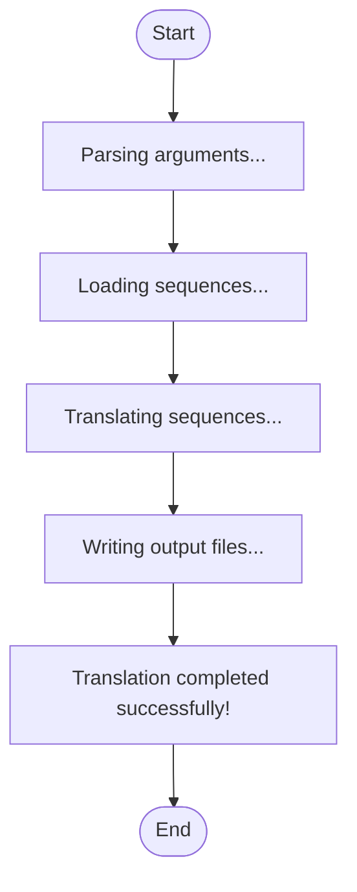

# DNA/RNA Frame Translation


## Installation

**[⬇️ Click here to install in Cauldron](http://localhost:50060/install?repo=https%3A%2F%2Fgithub.com%2Fnoatgnu%2Fdna-frame-translation-plugin)** _(requires Cauldron to be running)_

> **Repository**: `https://github.com/noatgnu/dna-frame-translation-plugin`

**Manual installation:**

1. Open Cauldron
2. Go to **Plugins** → **Install from Repository**
3. Paste: `https://github.com/noatgnu/dna-frame-translation-plugin`
4. Click **Install**

**ID**: `dna-frame-translation`  
**Version**: 1.0.0  
**Category**: proteomics  
**Author**: Toan Phung

## Description

Translates DNA/RNA sequences to amino acid sequences using 3-frame or 6-frame translation. Supports custom start/stop codons or translation from position 0. Useful for proteogenomics, novel peptide discovery, and alternative splicing analysis.


## Workflow Diagram



## Runtime

- **Environments**: `python`

- **Entrypoint**: `translation_runner.py`

## Inputs

| Name | Label | Type | Required | Default | Visibility |
|------|-------|------|----------|---------|------------|
| `input_file` | Input Sequence File | file | Yes | - | Always visible |
| `input_format` | Input Format | select (auto, fasta, csv, tsv) | Yes | auto | Always visible |
| `sequence_column` | Sequence Column | text | No | sequence | Visible when `input_format` is one of: `csv`, `tsv` |
| `id_column` | ID Column | text | No | gene | Visible when `input_format` is one of: `csv`, `tsv` |
| `translation_mode` | Translation Mode | select (three_frame, six_frame) | Yes | six_frame | Always visible |
| `use_start_codons` | Require Start Codon | boolean | No | false | Always visible |
| `start_codons` | Start Codons | text | No | ATG | Visible when `use_start_codons` = `true` |
| `use_stop_codons` | Stop at Stop Codon | boolean | No | true | Always visible |
| `stop_codons` | Stop Codons | text | No | TAA,TAG,TGA | Visible when `use_stop_codons` = `true` |
| `min_length` | Minimum Peptide Length | number (min: 0, max: 10000, step: 1) | No | 0 | Always visible |
| `max_length` | Maximum Peptide Length | number (min: 0, max: 100000, step: 1) | No | 0 | Always visible |
| `genetic_code` | Genetic Code Table | select (1, 2, 3, 4, 5, 6, 9, 10, 11, 12, 13, 14, 15, 16, 21, 22, 23, 24, 25, 26, 27, 28, 29, 30, 31, 32, 33) | No | 1 | Always visible |

### Input Details

#### Input Sequence File (`input_file`)

File containing DNA/RNA sequences (FASTA or tabular format)


#### Input Format (`input_format`)

Format of input file. 'auto' detects based on file extension.

- **Options**: `auto`, `fasta`, `csv`, `tsv`

#### Sequence Column (`sequence_column`)

Column name containing sequences (for tabular input)


#### ID Column (`id_column`)

Column name for sequence identifiers (for tabular input)


#### Translation Mode (`translation_mode`)

3-frame (forward only) or 6-frame (forward + reverse complement)

- **Options**: `three_frame`, `six_frame`

#### Require Start Codon (`use_start_codons`)

If enabled, translation starts from specified start codons. If disabled, translates from position 0 in each frame.


#### Start Codons (`start_codons`)

Comma-separated list of start codons (standard: ATG; alternatives: GTG, CTG, TTG, ACG)

- **Placeholder**: `ATG,GTG,CTG,TTG,ACG`

#### Stop at Stop Codon (`use_stop_codons`)

If enabled, translation stops at specified stop codons. If disabled, translates entire frame (stop codons become *).


#### Stop Codons (`stop_codons`)

Comma-separated list of stop codons (standard: TAA, TAG, TGA)

- **Placeholder**: `TAA,TAG,TGA`

#### Minimum Peptide Length (`min_length`)

Minimum amino acid length for output sequences (0 = no filter)


#### Maximum Peptide Length (`max_length`)

Maximum amino acid length for output sequences (0 = no limit)


#### Genetic Code Table (`genetic_code`)

NCBI genetic code table: 1=Standard, 2=Vertebrate Mito, 3=Yeast Mito, 4=Mold Mito, 5=Invertebrate Mito, 6=Ciliate, 9=Echinoderm Mito, 10=Euplotid, 11=Bacterial, 12=Alt Yeast, 13=Ascidian Mito, 14=Alt Flatworm Mito, 15=Blepharisma, 16=Chlorophycean Mito, 21-33=Various specialized codes

- **Options**: `1`, `2`, `3`, `4`, `5`, `6`, `9`, `10`, `11`, `12`, `13`, `14`, `15`, `16`, `21`, `22`, `23`, `24`, `25`, `26`, `27`, `28`, `29`, `30`, `31`, `32`, `33`

## Outputs

| Name | File | Type | Format | Description |
|------|------|------|--------|-------------|
| `translated_sequences` | `translated_sequences.fasta` | data | fasta | Translated amino acid sequences in FASTA format |
| `translation_summary` | `translation_summary.tsv` | data | tsv | Summary table with sequence IDs, frames, lengths, and ORF positions |
| `translation_report` | `translation_report.txt` | report | txt | Summary statistics of the translation |

## Requirements

- **Python Version**: >=3.11

### Python Dependencies (External File)

Dependencies are defined in: `requirements.txt`

- `click>=8.0.0`
- `biopython>=1.81`
- `pandas>=2.0.0`

> **Note**: When you create a custom environment for this plugin, these dependencies will be automatically installed.

## Example Data

This plugin includes example data for testing:

```yaml
  min_length: 20
  genetic_code: 1
  start_codons: ATG,GTG,CTG
  max_length: 0
  input_format: auto
  translation_mode: six_frame
  use_start_codons: false
  use_stop_codons: true
  stop_codons: TAA,TAG,TGA
```

Load example data by clicking the **Load Example** button in the UI.

## Usage

### Via UI

1. Navigate to **proteomics** → **DNA/RNA Frame Translation**
2. Fill in the required inputs
3. Click **Run Analysis**

### Via Plugin System

```typescript
const jobId = await pluginService.executePlugin('dna-frame-translation', {
  // Add parameters here
});
```
